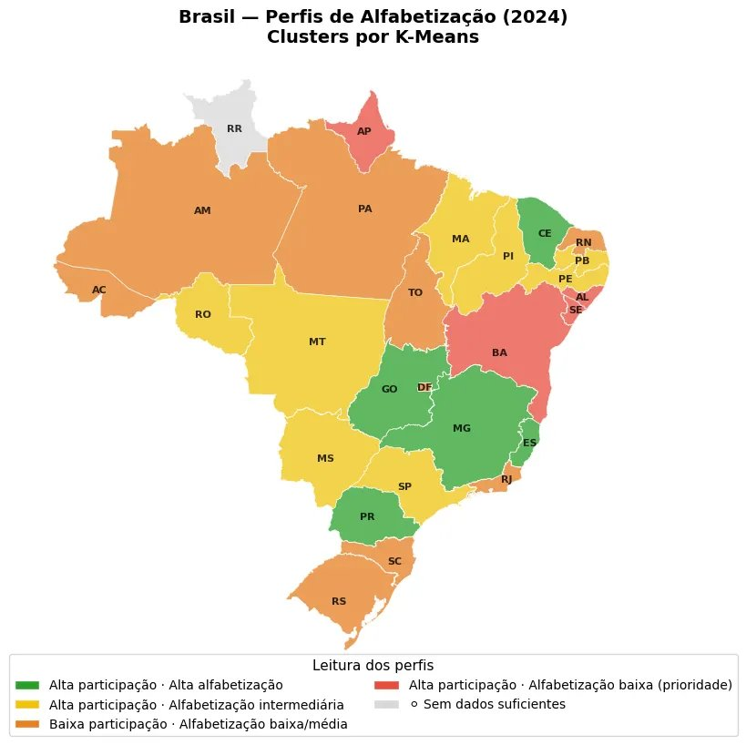

# 🇧🇷 Alfabetiza Brasil — Análise com Machine Learning

> *Perfis distintos exigem estratégias distintas. Não se trata de "falta de dados", mas de capacidade de agir de forma diferenciada.*

Análise dos dados oficiais do programa **Alfabetiza Brasil (INEP/MEC 2024)** usando Machine Learning para entender os padrões de alfabetização nas 27 UFs brasileiras.

📝 **Artigo no Medium:** [Alfabetização no Brasil em 2024 vista pelo K-Means](https://medium.com/data-hackers/alfabetiza%C3%A7%C3%A3o-no-brasil-em-2024-vista-pelo-k-means-🌀) · publicado no **Data Hackers**

<br>

<div align="center">

</div>

<br>

## 🔍 Dois ângulos, mesma pergunta

| Notebook | Técnica | Pergunta |
|:---|:---|:---|
| [`kmeans_alfabetiza_brasil.ipynb`](kmeans_alfabetiza_brasil_colab.ipynb) | **K-Means** | Quais estados têm perfis parecidos de alfabetização e participação? |
| [`regressao_alfabetiza_brasil.ipynb`](regressao_alfabetiza_brasil_colab.ipynb) | **Regressão + Random Forest** | A participação na avaliação está associada à taxa de alfabetização? |

[](https://colab.research.google.com/github/LauraMattz/alfabetiza-brasil-ml/blob/main/kmeans_alfabetiza_brasil_colab.ipynb)
[](https://colab.research.google.com/github/LauraMattz/alfabetiza-brasil-ml/blob/main/regressao_alfabetiza_brasil_colab.ipynb)

<br>

## 📊 O que os dados revelaram

O K-Means identificou **4 perfis distintos** de alfabetização no Brasil:

| Perfil | Alfabetização | Participação | Leitura |
|:---:|:---:|:---:|:---|
| 🟢 | 70–85% | 90–98% | É possível alfabetizar bem em escala no país |
| 🟡 | 55–65% | 85–95% | Diagnóstico sólido, resultados ainda aquém |
| 🟠 | 45–60% | 70–85% | Antes de cobrar resultados, fortalecer cobertura |
| 🔴 | 35–50% | 90–95% | O sistema enxerga o problema, mas não resolve |

A regressão confirmou **associação positiva** entre participação e alfabetização, com Random Forest superando o modelo linear em cross-validation.

<br>

## 🧠 Por que K-Means e não ranking?

Em análises educacionais é comum classificar estados por nota média. O K-Means evita isso:

- Sem rótulos prévios de "melhor" ou "pior"
- Padrões emergem da estrutura dos dados
- Participação entra como critério (não só resultado)
- Perfis diferentes pedem políticas diferentes

<br>

## 🛠️ Stack

`Python` · `Pandas` · `NumPy` · `Scikit-Learn` · `Matplotlib` · `Seaborn` · `GeoPandas` · `geobr`

<br>

## ▶️ Como rodar

Direto no Colab (recomendado) — clique nos badges acima.

Ou localmente:

```bash
git clone https://github.com/LauraMattz/alfabetiza-brasil-ml.git
cd alfabetiza-brasil-ml
pip install pandas numpy scikit-learn matplotlib seaborn geopandas geobr
jupyter notebook
```

Os notebooks baixam os dados direto do INEP — não precisa download manual.

<br>

## 📂 Estrutura

```
alfabetiza-brasil-ml/
├── kmeans_alfabetiza_brasil_colab.ipynb    # Clusterização K-Means
├── regressao_alfabetiza_brasil_colab.ipynb # Regressão + Random Forest
├── clusters-mapa-brasil.png               # Mapa de resultados
└── README.md
```

<br>

## 📎 Contexto

Projeto desenvolvido a partir do curso **Data Science and Big Data: Making Data-Driven Decisions** (MIT). A proposta é transformar exercícios acadêmicos em análises aplicadas a problemas reais usando dados públicos brasileiros.

---

Feito por Laura Mattos· [LinkedIn](https://www.linkedin.com/in/lauramattosc/)
